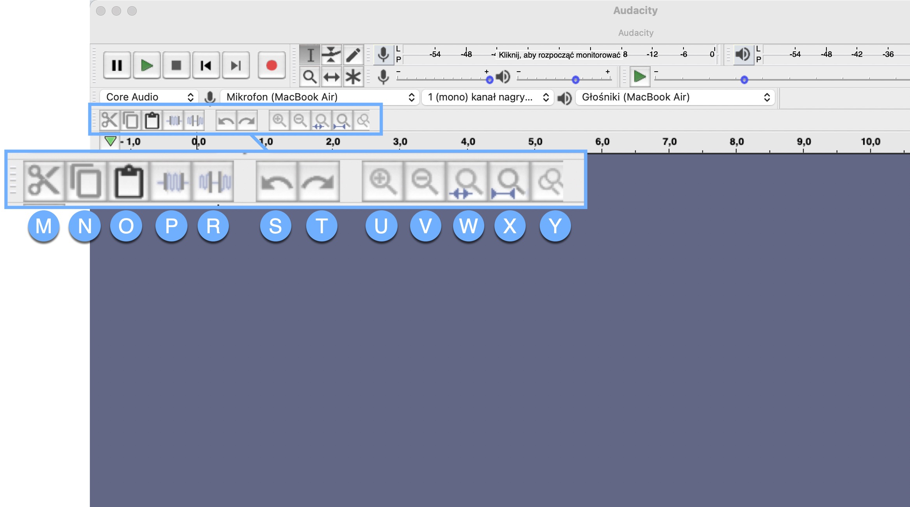

# Editing

When you’re done recording it’s time to edit. 

This is Edit Toolbar, it allows you to cut, silence, and much more.

(from left to right)

- Cut- removes the selected audio

- Copy- copies the selected audio

- Paste- inserts clipboard content 

- Trim - removes all the audio but the selection 

- Silence- replaces selected audio with silence

- Undo- reverses the last editing operation

- Redo- restores the last editing operation that was undone

- Zoom in- zooms in to a higher magnification level

- Zoom out - zooms out to a lower magnification level

- Zoom to Selection- Zooms a selection region in or out so that it fits in the available horizontal window area

- Fit to Width-  Zooms in or out so that the entire audio of the project fits in the available horizontal track area

- Zoom toggle- zooms between two preset levels

Noise reduction:

It is very useful, especially when you deal with background noise, such as buzzing, or humming. 

Follow these five easy steps to reduce the annoying background noise: 

1. Select the region of the waveform that contains noise

2. Go to Effects menu and select Noise reduction 

3. Click Get the Noise Profile ( the window closes automatically)

4. Go to Effects and select Noise reduction again 

5. Click OK

Once you’re done editing, it’s time to export the MP3 file. It’s the format you need to upload your podcast on the hosting platform.

To export an mp3 file follow these simple steps: 

1. Go to File menu

2. Select Export  

3. Select Export to MP3

4. Name the file 

5. Click Export