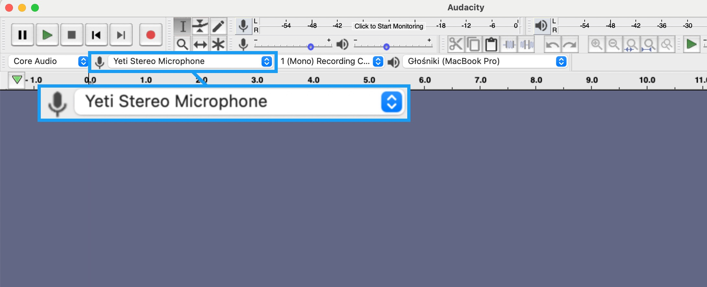
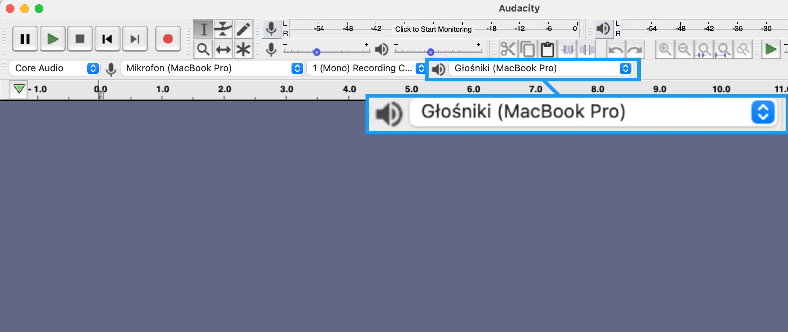

# Recording 
---

If you want to start a podcast, you need editing software. Audacity is an app that has been around for years and, what’s more important, is completely free.  It’s available on all systems and has everything you need to record and edit audio.

Download it [here](https://www.audacityteam.org/download/)

 

| Advantages| Disadvantages |
| --------- |-------------- |
| Free      | No multitrack recording |
| Recording and editing tools | Old-fashioned UI |

 

To start recording follow these simple steps: 

1. Plug in your microphone (plug your headphones into your Microphone if you want to use them) 

2. Open Audacity

3. Select the right microphone here: 

4. Select speaker here:

 
 To record audio use Transport menu:

(from left to right)

- **Pause**: temporarily stops recording or playing

- **Play**: playback from where the cursor is, you can also play a selected fragment

- **Stop**: stops recording or playing the audio 

- **Skip to Start**: skips to the beginning of the recording 

- **Skip to End**: skips to the end of the recording 

- **Record**: starts recording 

 

When you’re ready press **Record**!

 

When you're done recording don’t forget to save your episode.

To Save a file: 

**File**> **Save File**> **Save File**