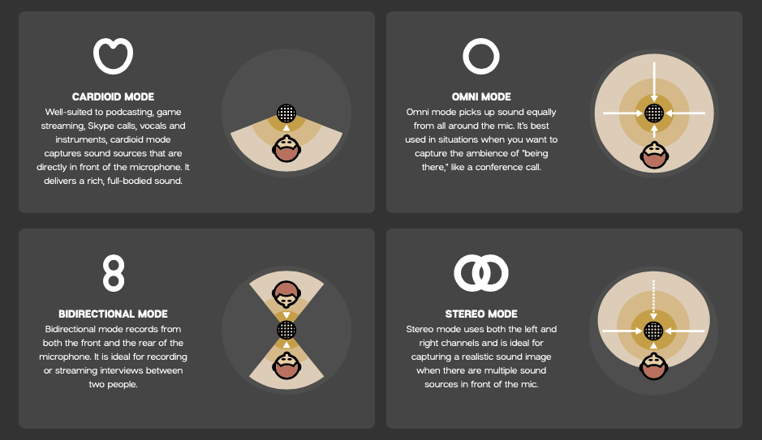

# Blue Yeti Microphone 

The Blue Yeti is one of the most popular microphones among podcasters and content creators.

Here are some of its advantages and disadvantages:

|Advantages: | Disadvantages: |
| ---------- | -------------- |
|Versatility: multiple polar patterns | Sensitivity         |
| Easy to use: it’s a USB microphone which means you don’t need any additional equipment |           Not portable |
| Control: headphone volume, pattern selection, instant mute, and microphone gain controls |
| Design: it comes with a built-in stand| | 

## Polar Patterns 

If you want record a podcast, it’s important to learn about **Polar Patterns**. They are settings you choose based on the type of podcast you want to record and the recording environment.

The Blue Yeti offers four:

- **Omnidirectional**: picks up sound from all directions at the same time. It can be used for conference calls, roundtable discussions and interviews.

- **Bidirectional**: picks up the sound from opposite sides of the microphone. It can be used to record interviews and duet recordings.

- **Cardioid**: picks up the sound from the front and sides of the microphone. It can be used for podcasting.

- **Stereo**: picks up sound from left and right. It can be used for live performances and field recordings.

If you want to ensure great sound quality you might want to invest in some accessories such as Pop filter. 

Read more about the microphone and its accesories [here](https://www.thepodcasthost.com/equipment/blue-yeti-microphone-accesory-guide/) and [here](https://riverside.fm/blog/best-blue-yeti-accessories )
 

